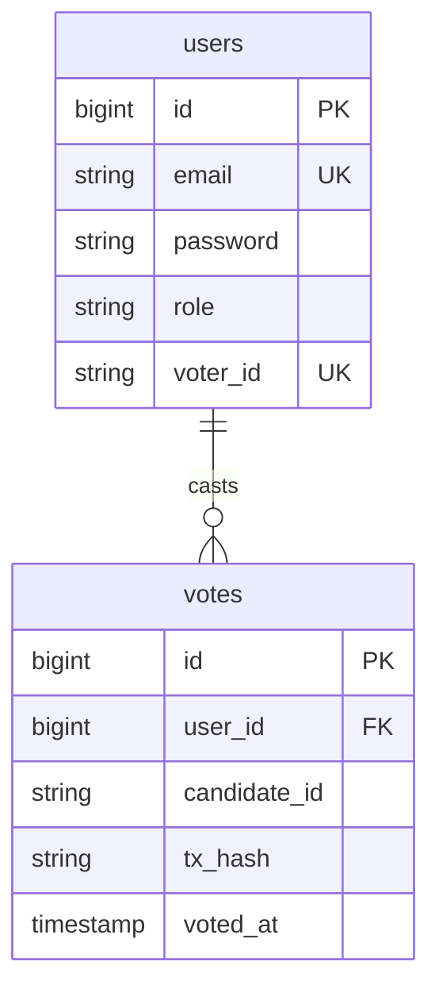

# Database Schema Guide

This document describes the PostgreSQL database structure used by the VoteChain backend for user management and vote auditing.

## Table: `users`
This table stores account information and authentication credentials.

| Column | Type | Constraints | Description |
| :--- | :--- | :--- | :--- |
| `id` | `bigint` | `PRIMARY KEY` | Internal auto-incrementing ID. |
| `email` | `varchar` | `UNIQUE`, `NOT NULL` | User's login email. |
| `password` | `varchar` | `NOT NULL` | BCrypt-hashed password. |
| `full_name` | `varchar` | `NOT NULL` | User's display name. |
| `role` | `varchar` | `NOT NULL` | Either `VOTER` or `ADMIN`. |
| `voter_id` | `varchar` | `UNIQUE`, `NOT NULL` | The verified ID used on the blockchain. |
| `phone` | `varchar` | | Optional contact number. |
| `profile_photo` | `text` | | Base64 encoded profile image. |

---

## Table: `votes`
This table stores "receipts" of votes for the user's personal history. 

| Column | Type | Constraints | Description |
| :--- | :--- | :--- | :--- |
| `id` | `bigint` | `PRIMARY KEY` | Internal auto-incrementing ID. |
| `user_id` | `bigint` | `FOREIGN KEY` | References `users(id)`. |
| `election_id` | `varchar` | | ID of the election. |
| `candidate_id` | `varchar` | | ID of the candidate voted for. |
| `tx_hash` | `varchar` | | The blockchain transaction ID (for verification). |
| `voted_at` | `timestamp` | | Date and time the vote was cast. |
| `election_title`| `varchar` | | Cache of the election name. |
| `region` | `varchar` | | Cache of the election region. |
| `status` | `varchar` | | Status of the election (Live/Completed). |
| `election_img` | `text` | | Cache of the election image URL. |

---

## Entity Relationship Diagram (ERD)

### Foreign Key Logic:
*   **`votes.user_id` -> `users.id`**: This link ensures that every vote in the database is tied to a valid registered user. 
*   **Deletion Behavior**: Because of this constraint, you cannot delete a user from the `users` table if they have records in the `votes` table. You must either delete their votes first or use a cascading delete (which the `manage_users.sh` script now handles for you).

### Note on Anonymity:
While the **PostgreSQL** database stores the link between the `user_id` and the `candidate_id` (for the "My Votes" page), the **Blockchain** tallying logic is designed to be the primary source of truth for the count, providing a layer of decentralized verification.
